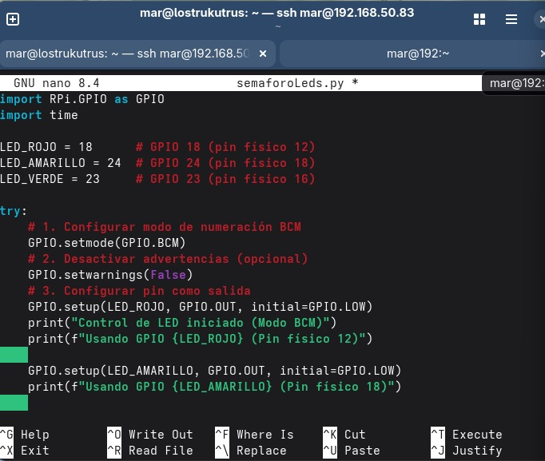
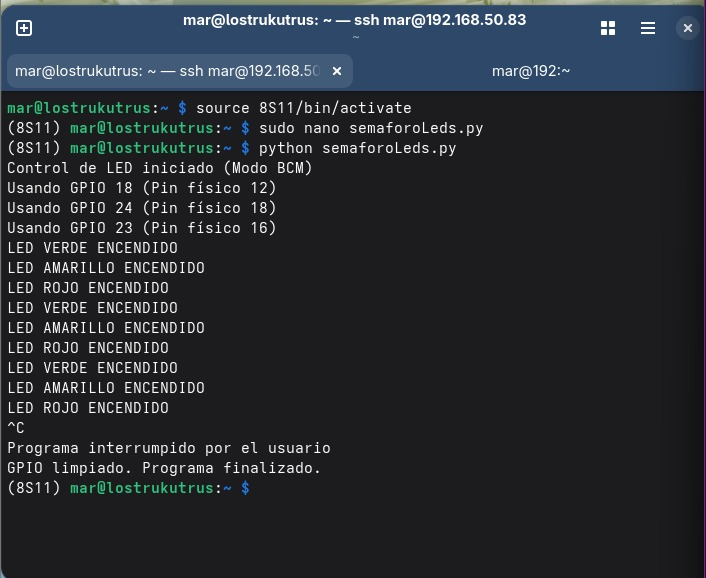
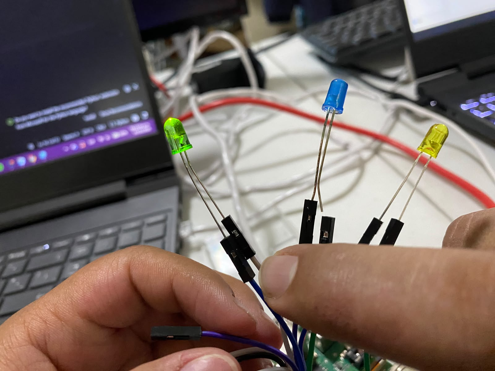
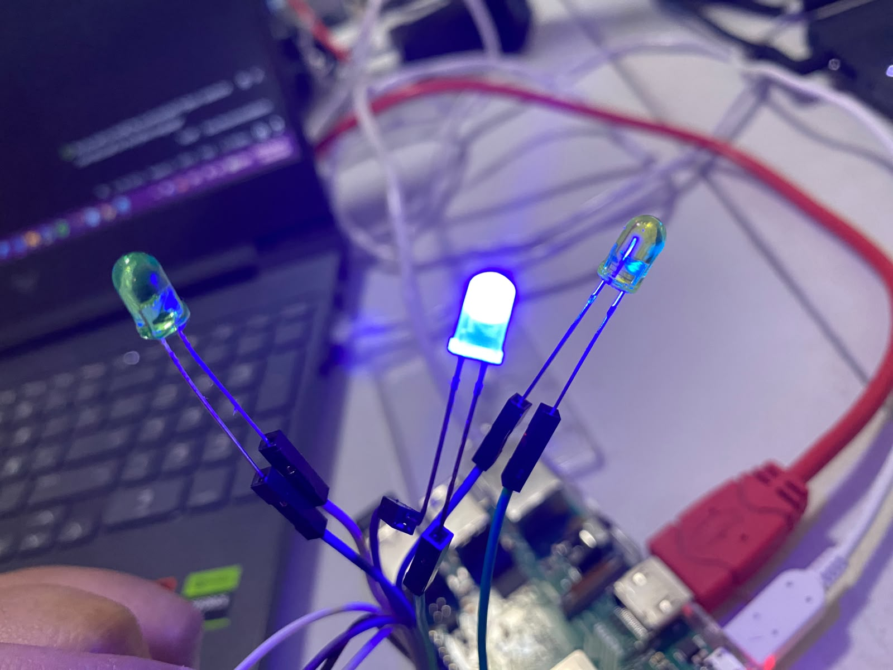
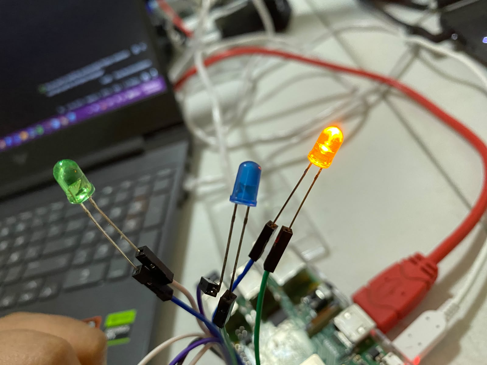
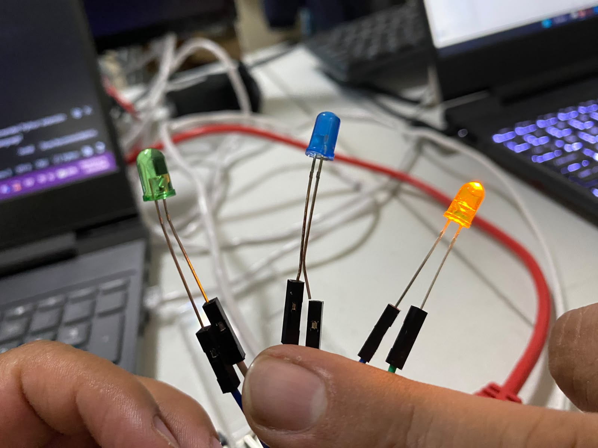

# P2_SemaforoLeds
# Práctica: Simulación de Semáforo con GPIO en Raspberry Pi

Este proyecto consiste en la creación de un semáforo básico utilizando una Raspberry Pi y tres LEDs (Rojo, Amarillo y Verde). La práctica se realizó de forma remota: el entorno de desarrollo fue una máquina virtual con **Fedora** en **VirtualBox**, desde la cual se estableció una conexión **SSH** hacia la Raspberry Pi para ejecutar el código en Python.

## 🛠️ Requisitos y Entorno

*   **Cliente:** Fedora Linux (Máquina Virtual en VirtualBox).
*   **Servidor/Dispositivo:** Raspberry Pi (con sistema operativo basado en Linux).
*   **Lenguaje:** Python 3.
*   **Librerías:** `RPi.GPIO`
*   **Conexión:** Red local vía SSH.

## 🔌 Conexiones de Hardware (Pines)

Según el código y la configuración BCM, las conexiones físicas son las siguientes:

| Color LED | GPIO (BCM) | Pin Físico | Función |
| :--- | :--- | :--- | :--- |
| **Rojo** | GPIO 18 | Pin 12 | Salida (Output) |
| **Amarillo** | GPIO 24 | Pin 18 | Salida (Output) |
| **Verde** | GPIO 23 | Pin 16 | Salida (Output) |


## 🚀 Pasos Realizados (Comandos)

A continuación se detallan los comandos utilizados en la terminal para conectarse a la Raspberry Pi y preparar el entorno.

### 1. Conexión SSH
Desde la terminal de Fedora, nos conectamos a la Raspberry Pi (usuario `mar` e IP `192.168.50.83`):
```bash
ssh mar@192.168.50.83
```
### 2. Preparación del Entorno Virtual
Dentro de la Raspberry Pi, se activó un entorno virtual de Python para gestionar las dependencias:
```bash
source 8S11/bin/actívate
```
*Nota: El prompt cambia a (8S11) indicando que el entorno está activo.

### 3. Ejecución del Script
Se creó el archivo semaforoLeds.py (ver código abajo) y se ejecutó con permisos de superusuario (necesarios para acceder a los GPIO):
```bash
sudo nano semaforoLeds.py  # Para editar el código
python semaforoLeds.py     # Para ejecutar
```

## 📋 Explicación del Funcionamiento
1.	Configuración: Se importan las librerías RPi.GPIO y time. Se definen las variables para los pines GPIO correspondientes a cada color.
2.	Inicialización: Se configura el modo de numeración BCM (Broadcom) y se establecen los tres pines como salidas (GPIO.OUT), inicializándolos en estado bajo (GPIO.LOW) para que los LEDs comiencen apagados.
3.	Bucle Infinito (While True):
o	Verde: Se enciende el LED Verde durante 10 segundos.
o	Amarillo: Se enciende el LED Amarillo durante 3 segundos.
o	Rojo: Se enciende el LED Rojo durante 10 segundos.
4.	Manejo de Errores: Se utiliza un bloque try...except KeyboardInterrupt para detectar cuando el usuario presiona Ctrl+C. Al hacerlo, el programa sale del bucle de forma limpia.
5.	Limpieza (finally): Independientemente de cómo termine el script, se ejecuta GPIO.cleanup() para liberar los pines GPIO y asegurarse de que no queden en un estado de alto voltaje, evitando daños al hardware o comportamientos extraños.
## 📸 Evidencia de Ejecución
En la terminal se observó el siguiente flujo:
1.	Activación del entorno (8S11).
2.	Creación del script 



3.	Ejecución del script con python semaforoLeds.py.
4.	Impresión en consola de la secuencia: LED VERDE, LED AMARILLO, LED ROJO.



5.	Interrupción manual con Ctrl+C y mensaje de limpieza exitosa.
6. Encendido de Leds exitoso





